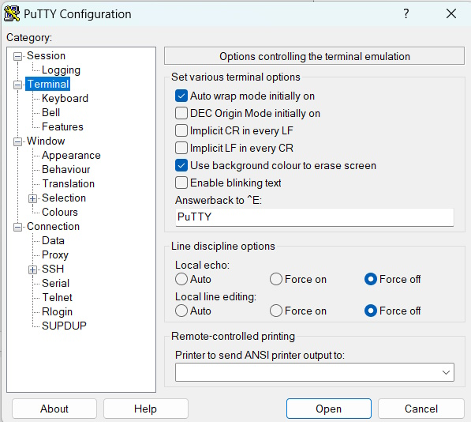
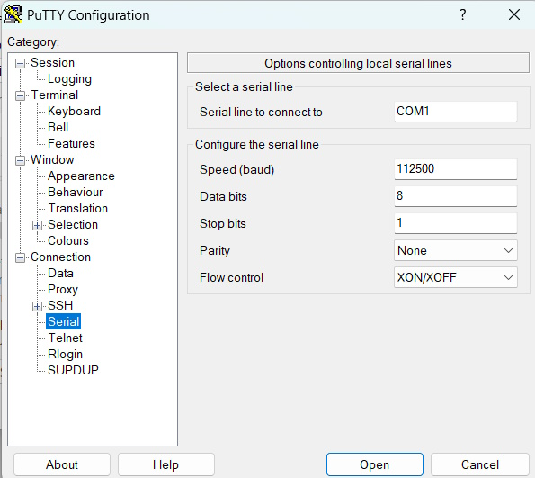

# SMbus battery reader
Reading data from a bq20z9xx smart battery controller via the SMBus (version 1.1) protocol. Using an ESP32
The serial output can be displayed via an Ansi terminal (f.e. putty)
# Putty Settings

For Putty to work, I found that in many cases I had to restart Putty. It looks like the Serial buffer gets polluted at startup.

# Connections
GND
SDA (SDI) (GPIO4) (D2)
SCL (SCK) (GPIO5) (D1)
The power of the bq20z9xx is supplied by the SCL line of the I2C. No need for additional power line. Wait 10 seconds after connectting before reading data. Use 4.7K or 10k resistors as pull up for SDA and SCL lines.

# Menu
1 = Displays the menu
2 = This needs to be selected at first. To determine the address of the Battery is. You can select a range (in hex or decimal format) by using f.e. '2 8 15' (a space is required between the numbers ).  
    This surches for a battery in the address range of 8 - 15. If no range is given (so only 2 without parameters, '2') default address surch is from 0 - 127.
Following commands can only be selected when an address has been found.
3 = Select and display a category of commands:
    1 = All commands telling information about the battery.
    2 = All commands giving user information.
    3 = The values calculated by the battery based on the use.
    4 = Commands with tells something about the status of the battery.
    5 = Commands calculating the Rates, see the SMBus protocol for details.
    Example: 3 (space) 1 (enter). So '3 1' selects the commands giving user information.
4 = Command name
    Selecting '4 ?' (4 (space) ? (enter)) displays all available commands. Including commands that sets the device, but these commands are only usefull whe the battery is in Unsealed or Full Access mode.
    F.e. 4 (space) remainingCapacityAlarm (enter), '4 remainingCapacityAlarm' selects the remainingCapacityAlarm command. Please note the command is case sensitive. In the example the 'C'and 'A' are capital letters.
5 = Unseal Battery command with default keys or specified keys. Keys may be given in decimal or hex format.
    F.e. 5 (space) 1000 (space) 2000 (enter), '5 1000 2000' uses 1000 as Key A, and 2000 as Key B. '5' uses the default values from the BQ Ic manufacturer. If command '5 ?' is given the key will be searched for. 
6 = Seal Battery command, switches the battery to default (sealed mode). Please note that some commands can still be selected but will give no result.
7 = Clear Permanent Failure. If the battery is in permanent failure mode (can be found via '3 1') this command clears the failure when the right keys are provided. Using '7' uses default values. Keys may
    be given in decimal or hex format. If command '7 ?' is given the key will be searched for.
    F.e. 7 (space) 3000 (space) 4000 (enter), '7 3000 4000' uses 3000 as Key A, and 4000 as Key B. '7' uses the default values from the BQ Ic manufacturer.
8 = Full Access command with default keys or specified keys. Keys may be given in decimal or hex format. Please note that device must be in unsealed mode before it can go into Full Acces mode.
    F.e. 8 (space) 5000 (space) 6000 (enter), '8 5000 6000' uses 5000 as Key A, and 6000 as Key B. '8' uses the default values from the BQ Ic manufacturer.
    Full Access mode can be used for specific commands, soem of thes commands are not provided by this tool. So using this command has limited use.

Remark: When typing wrong using backspace works on screen, but the command does not. Retype entire command after Entering. 
